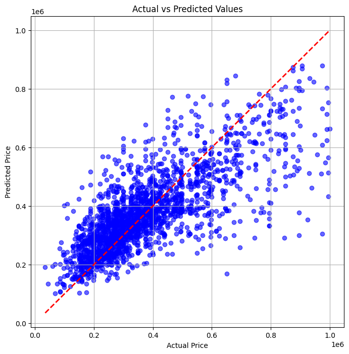

# Evaluation Report for Best and Last Model

## 1. Model Details

### Model Instantiation
```python

pipeline = RandomForestPipeline(
degree=2,
max_depth=10,
min_samples_leaf=2,
min_samples_split=2,
n_estimators=300,
random_state=42
)
```

## 2. Model Performance Metrics

### Mean Absolute Error (MAE)

Training Set: `54 756.00`

Test Set: `75 670.42`

### Root Mean Squared Error (RMSE)

Training Set: `79 468.51`

Test Set: `110 102.78`

### R² Score

Training Set: `0.81`

Test Set: `0.63`

### Mean Absolute Percentage Error (MAPE)

Training Set: `15.86%`

Test Set: `22.02%`

### Symmetric Mean Absolute Percentage Error (sMAPE)

Training Set: `15.06%`

Test Set: `20.38%`

## 3. Feature List and Selection Process

### Features Used

- Type
- Bedrooms
- Is_Equipped_Kitchen
- State
- Facades
- Swim_pool
- Municipality
- Region
- Average_Income
- Bedroom_Bin_Code
- Log_Living_Area
- Sqrt_Total_Outdoor_Area

### Feature Selection Process

Source: I used the dataset from the Analysis phase of the project. Added more info (Avg_Income and Region) using two datasets noted below.

Data Leakage: Had an issue with data leakage after adding Price_per_Sqm. Removed and avoided adding any features based off the target variable (Price).

## 4. Accuracy Computing Procedure

### Test Split

Test Split Percentage: **80/20**

Validation Methodology: **Train-Test Split**

 - The data was split into training (80%) and testing (20%) subsets using `train_test_split` from `scikit-learn`.
  - A fixed random state of 42 was used to ensure reproducibility.


## 5. Efficiency Metrics

### Training and Inference Time

Training Time: `1 min 11 sec`

Inference Time: Aprox. `12 ms per record`

## 6. Dataset Overview

### Final Dataset Summary

Number of Records: `10 485`

Number of Features: `14`

Dataset Sources:

**Fiscale statistiek van de inkomsten (Periode 2005 - 2022):**

https://statbel.fgov.be/nl/open-data/fiscale-statistiek-van-de-inkomsten

**Liste des codes postaux belges (communes):**

https://www.odwb.be/explore/dataset/postal-codes-belgium/table/


Dataset Preparation Steps:

Merging Datasets: Yes

Scraping Data: No

Data Cleaning:

- Started with 10485 rows x 14 columns
- Data was already mostly cleaned since previous analysis step.
- Double-checked for NaN values (None found)
- Checked for duplicates (None found)
- Checked that Garden_Area and Terrace_Area always had value > 0 if garden/terrace == True
- Terrace had 2231 inconsistent values - imputed them
- Dropped Municipality and Localities to avoid overfitting (Added Municipality back in later)
- Dropped columns Unnamed: 1 and Id because irrelevant to model
- Dropped Is_furnished because had lowest correlation value and severe imbalance (only 3% True).
- Dropped Land_Surface and Surface_total because I think they weren't scraped correctly.
- Dropped category 'mixed-use-building' from SubType - only interested in residential buildings.
- Dropped SubType after checking correlation (0.82)
- Encoding: Label encoded Type, Municipality, Region, Bedroom_Bin_Code

### Strategies applied that showed positive impact on model:

- Baseline Score: 
    - RMSE: `119 698.57`
    - R² Score: `0.57`

- Removed features with less than 0.3% importance.
    - RMSE: `119 681.10`
    - R² Score: `0.57`

- Aggregated Garden_Area and Terrace_Area into Total_Outdoor_Area
    - - RMSE: `119 334.62`
    - R² Score: `0.57`

- Log transformed Living_Area
    - RMSE: `119 267.08`
    - R² Score: `0.57`

- Sqrt transformed Total_Outdoor_Area
    - RMSE: `119 183.91`
    - R² Score: `0.57`

- Binned Bedrooms
    - RMSE: `119 178.53`
    - R² Score: `0.57`

- Implemented Polynomial Features
    - RMSE: `117 981.10`
    - R² Score: `0.58`

- Weighted Loss distribution
    - RMSE: `117 884.64`
    - MAE: `84 652.49`
    - R² Score: `0.58`

- Log transformed Price after Weighted loss
    - RMSE: `118 399.11`
    - MAE: `82 595.23`
    - R² Score: `0.58`

- Added Municipality back in for more granular location data
    - RMSE: `116 049.13`
    - MAE: `80 424.82`
    - R² Score: `0.59`

- Added feature Avg_Income (Merged with income dataset based on location)
    - RMSE: `110 102.78`
    - MAE: `75 670.42`
    - R² Score: `0.63`
    - Biggest leap in prediction power

### Strategies attempted that showed negative or no impact on model:

- Removed features with less than 1% importance.
    - RMSE: `119 843.01`
    - R² Score: `0.57`

- Log transformed Price (target)
    - RMSE: `122 009.71`
    - R² Score: `0.55`

- Log transformed Total_Outdoor_Area
    - RMSE: `119 187.34`
    - R² Score: `0.57`

- Added feature Price_per_Sqm
    - RMSE: `8 473.28`
    - R² Score: `1.00`
    - Caused data leakage

- Added feature Region_Avg_Living_Area
    - RMSE: `119 234.81`
    - R² Score: `0.57`

- Added feature Outdoor_to_Indoor_Ratio
    - RMSE: `119 589.11`
    - R² Score: `0.57`

- Removed Binned Bedrooms after Polynomial
    - RMSE: `118 007.19`
    - R² Score: `0.58`

- Applied Gaussian Noise Augmentation to address price imbalance (high vs low)
    - RMSE: `119 116.71`
    - MAE: `85 081.56`
    - R² Score: `0.57`

## Model Progress Visuals


## Tree Visuals


## SHAP Visual


## Residuals Visual


## Actual vs Predicted Prices Visual


